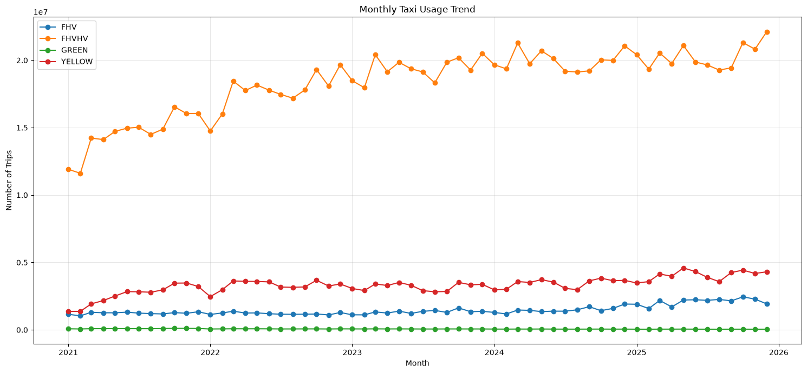
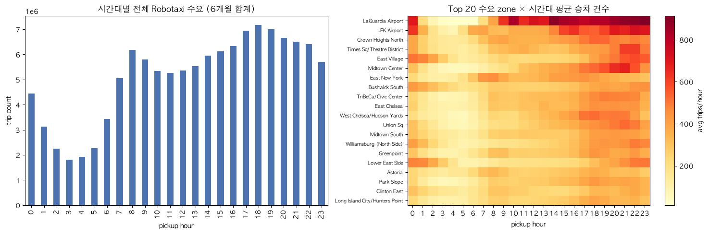
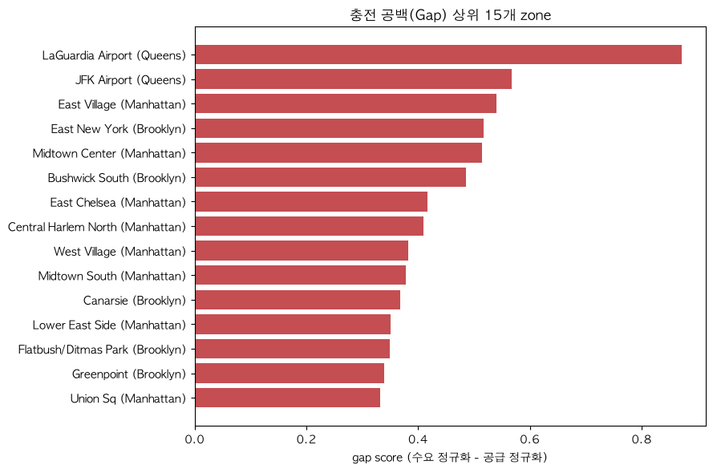
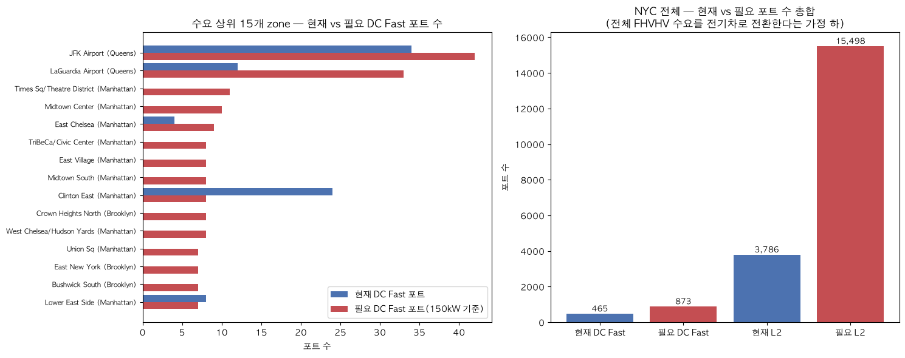
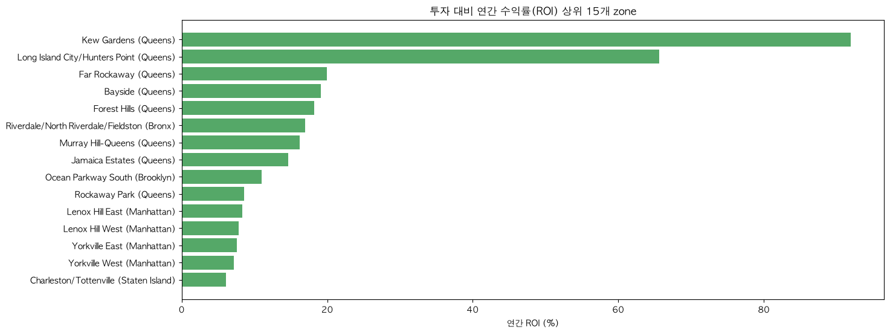
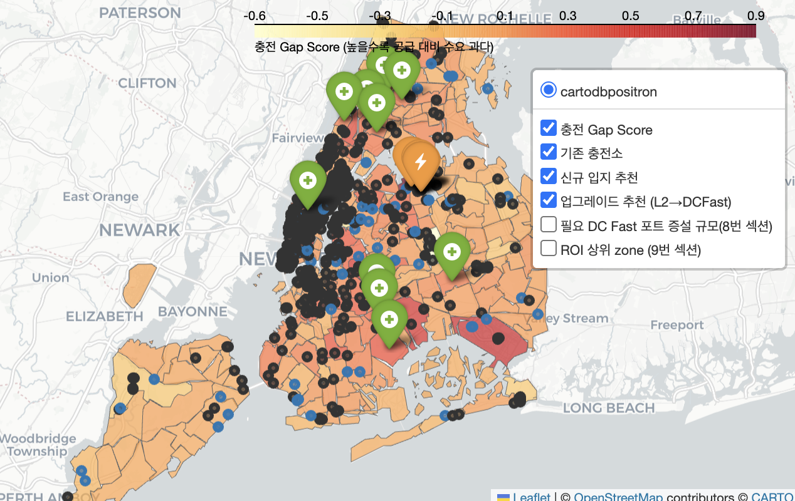

# NYC Robotaxi 수요 & EV 충전 인프라 분석 (`w4m2.ipynb`)

NYC TLC FHVHV(high volume for-hire, Uber/Lyft/Via/Juno) trip 데이터와 NY주 EV 충전소 데이터를 결합해,
"서비스를 자율주행으로 운영한다면 충전 인프라를 어디에 얼마나 갖춰야 하는가"를 분석한 노트북이다.

---

## 분석 이유

W4M2 과제 질문은 "이 데이터가 사람이 아니라 자율주행차 데이터라면 어떤 Data Product를 만들 수 있을까"였다. 여기서 다음 가정이 순서대로 이어진다.

### ① 자율주행차 → 전기차일 가능성이 높다
2026년 기준 로보택시 플랫폼은 예외 없이 전기차 기반이다 — Waymo는 2023년 전체 플릿을 Jaguar I-PACE로 전동화했고([Waymo](https://waymo.com/blog/2023/03/paving-way-toward-fully-electric-ride/)) Zoox는 133kWh 전용 EV, Cruise는 Chevrolet Bolt EV, Tesla도 Model Y·Cybercab(EV)을 쓴다. 이 분석은 Waymo의 **Jaguar I-PACE**를 기준 차종으로 삼았다.

### ② 전기차 플릿 → 충전 인프라가 병목이 된다
사람이 모는 택시는 기사가 알아서 충전하지만 AV 플릿은 관제가 모든 차량의 충전 스케줄을 직접 관리해야 한다. Stanford 연구팀은 샌프란시스코 사례로 충전소 입지·배차를 동시에 최적화하는 모델을 제시했고([arXiv:2107.00165](https://arxiv.org/abs/2107.00165)) CPUC 규제 데이터 분석에 따르면 Waymo의 공차운행(deadheading) 비율은 2025년 중반 이후로도 43~45%에 머물러 있다([Findings, 2026](https://findingspress.org/article/161870-millions-of-trips-waymo-empty-miles-california-s-first-thousand-days-of-commercial-robotaxi-service)). 충전소가 없는 zone에 차를 보내면 빈 차로 다른 zone까지 이동(deadhead)해야 해 운영비 증가와 서비스 공백으로 이어진다.

### ③ 그래서 Terawatt Infrastructure를 타겟으로 잡았다
로보택시 충전은 실제로 세 주체가 나눠 맡는다.

ⓐ Waymo처럼 운영사가 직접 운영하는 depot
ⓑ B2B로 운영사에 충전 인프라를 공급하는 업체
ⓒ Uber처럼 플랫폼이 직접 투자하는 depot.

이 분석의 타겟 고객은 ⓑ에 해당하는 **Terawatt Infrastructure**다. Terawatt는 최근 3억 달러 부채 조달로 Waymo향 depot(LA 잉글우드)을 확장 중이고([Bloomberg](https://www.bloomberg.com/news/articles/2026-06-24/waymo-charging-partner-terawatt-raises-up-to-300-million-in-debt)) Uber도 휴스턴에 4MW·충전기 40기 규모 depot을 짓는 등([TechCrunch](https://techcrunch.com/2026/06/17/uber-will-bring-its-premium-robotaxi-service-to-houston-in-2027/)) 세 주체 모두 실제로 투자를 집행하고 있다.

Terawatt가 로보택시 운영사와 depot 공급 계약을 맺기 전에 "어디에 얼마나 충전소를 지어야 수익이 나는가"를 먼저 계산해두면 선제적으로 투자 우선순위를 세울 수 있다.

### 이 분석이 답하려는 질문
**"Terawatt Infrastructure가 로보택시 시대를 대비한다면 어디에 먼저 충전 인프라를 지어야 사업이 성립하는가?"**

FHVHV trip 데이터로 zone별 수요를, NY주 공식 EV 충전소 데이터로 현재 공급을, I-PACE 전비 모델로 실제 충전 수요량(kWh)을 계산해 "수요는 많은데 충전소가 없는 zone" → "ROI가 검증되는 zone" 순으로 투자 우선순위를 도출한다.

---

## 차종 선정 이유

TLC 데이터는 [TLC 공식 분류](https://www.nyc.gov/site/tlc/businesses/e-hail-providers.page) 기준 Yellow·Green·FHV·FHVHV 4개 서비스 유형으로 나뉜다. 배차 구조와 이용 추이를 기준으로 자율주행 수요의 proxy를 좁혔다.

- **Yellow**: 길거리 호출(street hail) 중심 구조라 앱 배차 기반인 로보택시와 다르고 2021~2025년 이용량도 감소 추세라 미선정.
- **Green**: 마찬가지로 street-hail 기반인 데다 운행 지역이 외곽 자치구로 제한돼 있고 이용량도 감소 추세라 미선정.
- **FHV**: street hail이 아닌 사전예약(prearranged) 방식으로 배차돼 실시간 앱 매칭 구조가 아니라 미선정.
- **FHVHV(선정)**: Uber·Lyft 등 실시간 앱 매칭(e-hailing) 구조라 "호출하면 차가 오는" 방식이 로보택시와 가장 유사하고, 2021~2025년 유일하게 성장해 분석 기간(2025-07~2025-12) 기준 1.2억+ trip 규모를 보인다.

*2021~2025 월별 서비스 유형별 trip 수 추이. FHVHV(high volume for-hire)가 Yellow/Green 택시를 압도하며 사실상 유일하게 성장하는 추이라, 로보택시 수요의 proxy로 FHVHV를 택한 근거가 된다.*

---

## 데이터 소스

| 데이터 | 출처 | 비고 |
|---|---|---|
| EV 충전소 (NY주 전체 5,555개소) | `data.ny.gov` Socrata API (`7rrd-248n`) | `data/ev/ev_charging_stations_ny.json` |
| TLC taxi zone 폴리곤 · lookup | TLC 공식 배포본 | `data/zones/` |
| FHVHV trip (2025-07 ~ 2025-12, 6개월, 1.2억+ row) | NYC TLC Trip Record Data | `data/fhvhv_tripdata_*.parquet`, 로컬 Spark(`local[*]`)로 집계 |

---

## 노트북 구성 (섹션별 요약)

| # | 섹션 | 핵심 산출물 |
|---|---|---|
| 1 | 데이터 적재 (EV 충전소 & Taxi Zone) | 공간 조인으로 NYC 내 충전소 887개소 확정 |
| 2 | Robotaxi 수요 데이터 (Spark 집계) | zone×날짜×시간대 승/하차 집계, 총 122,594,493 trip |
| 3 | 충전소 커버리지 분석 | `avg_hourly_trips`, `demand_per_port` 등 zone별 커버리지 지표 |
| 4 | 충전 공백(Gap) 탐지 | `gap_score` 정규화 지표, 최고 Gap zone = LaGuardia Airport |
| 5 | 신규 충전소 입지 추천 | 충전소 0개 zone 중 수요 상위 10곳 (Canarsie, Brownsville 등) |
| 6 | Level 2 → DC Fast 업그레이드 추천 | LaGuardia 공항 주차장 등 상위 10곳 |
| 7 | 필요 충전 포트 수 정밀 산정 | 전력량 기반 계산 — NYC 전체 추가 필요 DC Fast **692대** / L2 **12,046대** |
| 8 | 충전소 확충 비용 & ROI 분석 | zone·자치구별 투자비용, ROI 랭킹, 매입 vs 리스 비교 |
| 9 | Robotaxi 충전 및 재배치 추천 | zone별 권장 충전 시간대, 피크시(18시) 재배치 후보 |
| 10 | 운영사 대시보드 | KPI 요약 + 4패널 차트 + 레이어 토글 가능한 인터랙티브 지도 |

---

## 주요 결과 시각자료

### 시간대별 수요와 Zone별 히트맵

*왼쪽: 6개월 합계 기준 시간대별 전체 수요 — 출퇴근보다 저녁 17\~19시에 피크가 몰린다. 오른쪽: 수요 상위 20개 zone × 시간대 평균 승차 건수 히트맵 — LaGuardia·JFK 공항이 하루 종일 압도적으로 진하다. 이 두 패턴이 이후 3~9번 섹션(커버리지·gap·포트 산정)의 출발점이다.*

### 충전 공백(Gap) 탐지

`gap_score = norm_demand - norm_supply` 상위 15개 zone. 값이 클수록 "수요는 많은데 충전 인프라가 부족한" zone이다 — LaGuardia Airport가 최상위.

### 신규 충전소 입지 추천

충전소가 아예 없는(`station_count == 0`) zone 중 수요 상위 5곳 (표 예시, 전체 10곳은 노트북 참고):

| 순위 | Zone | Borough | 평균 시간당 수요 | 피크시간 평균 수요 |
|---|---|---|---|---|
| 1 | Canarsie | Brooklyn | 209.6 | 322.4 |
| 2 | Brownsville | Brooklyn | 165.3 | 236.3 |
| 3 | Garment District | Manhattan | 149.4 | 216.8 |
| 4 | West Concourse | Bronx | 146.2 | 209.1 |
| 5 | Mount Hope | Bronx | 131.3 | 204.8 |

### 필요 충전 포트 수 정밀 산정

수요 상위 15개 zone의 현재 vs 필요 DC Fast 포트 수, 그리고 NYC 전체 현재 vs 필요 포트 총합(L2/DC Fast).

### 충전소 확충 비용 & ROI 분석

ROI 상위 15개 zone 막대차트(왼쪽)와 투자비용 vs 연간수익 버블 스캐터(오른쪽, 버블 크기 = 일일 필요 충전횟수, 색상 = 자치구). 구체적인 상위 5개 zone 수치는 [결론 및 투자 우선순위 제안](#결론-및-투자-우선순위-제안) 표를 참고.

### 운영사 대시보드

Gap Score 히트맵 · 기존 충전소 · 신규 입지 추천 · 업그레이드 추천 · ROI 상위 zone 레이어를 토글할 수 있는 인터랙티브 folium 지도.

---

## 핵심 가정

- **완충 전력량**: `zone_roi_ipace.csv`에서 역산한 완충 1회당 **67.76kWh** (I-PACE급 전비, 약 119.6mile/충전)
- **충전기 처리 용량**: Level 2 = 7.2kW(완충 9.4시간), DC Fast = 150kW(완충 27분), 가동률 70%
- **설치 비용(포트당, Expected)**: L2 \$8,250 / DC Fast \$145,000 (Low~High 균등분포 가정의 평균)
- **자치구별 토지가($/sqft, Expected)**: Manhattan 1,400 · Brooklyn 475 · Queens 275 · Bronx 210 · Staten Island 140
- **포트당 필요 부지면적**: 324 sqft (충전 스탈 162 sqft × 동선 여유 배수 2) / (1 sqft ≒ 0.03 평)
- **연간 토지 리스율**: 6.5% (토지가치 기준)

---

## 결론 및 투자 우선순위 제안

전체 인프라(추가 필요 L2 12,046대 + DC Fast 692대)를 한 번에 갖추려면 토지 매입만 약 **\$2.815B**, 혹은 매년 **\$183M**의 토지 리스 비용이 든다(손익분기 약 15.4년). 이 정도 규모를 시 전체에 일괄 리스·매입하는 것은 비용 부담이 너무 커서 현실적인 1차 실행안이 아니다.

대신 `charging_model_2_ranked_by_ROI.csv`의 **ROI 상위 5개 zone**을 보면 흥미로운 패턴이 나온다 — 5곳 모두 **Queens** 소재이다(토지가가 Manhattan의 5분의 1 수준이라 같은 수요에도 투자비가 훨씬 적게 들기 때문).

| 순위 | Zone | 투자비용(Expected) | 연간 예상수익 | ROI | 개별 payback |
|---|---|---|---|---|---|
| 1 | Kew Gardens | $97,350 | $89,503 | 91.9% | 1.1년 |
| 2 | Long Island City/Hunters Point | $468,200 | $307,408 | 65.7% | 1.5년 |
| 3 | Far Rockaway | $468,200 | $93,568 | 20.0% | 5.0년 |
| 4 | Bayside | $486,750 | $92,911 | 19.1% | 5.2년 |
| 5 | Forest Hills | $1,404,600 | $255,669 | 18.2% | 5.5년 |

이 5개 zone에 먼저 집중 투자한다면 총 투자비용은 약 \$2,925,100, 합산 연간 예상수익은 약 \$839,057로, 합산 기준 손익분기점은 약 3.5년이다(zone별로는 빠른 곳 1.1년부터 느린 곳 5.5년까지 분포하며, 개별 zone 단위로 봐도 대체로 5년 안팎에 회수된다).

**제안**: 시 전체 리스/매입 대신, 초기 자본을 ROI가 검증된 Queens 5개 zone에 먼저 배치해 5년 이내 회수를 확인한 뒤, 회수된 자본과 운영 데이터를 바탕으로 다음 우선순위 zone(주로 Gap score 상위 지역)으로 단계적으로 확장하는 것이 현실적인 실행 전략이다.

---

## 한계

- FHVHV를 Robotaxi 수요의 proxy로 사용 — 실제 로보택시 배차/재배치 비용은 반영하지 못한다.
- 모든 분석이 zone 단위 해상도라 zone 내부의 정확한 부지 추천은 불가능하다(zone centroid로 대표).
- 8~9번 섹션의 포트 수·비용·ROI 추정치는 전력·설치비 가정(150kW, 70% 가동률, 2026 업계 가이드 비용)에 의존한다 — 가정이 바뀌면 결과도 비례해 바뀐다.
- 부지에 대한 예상 비용은 Low~High 균등분포의 기댓값이며, 실제 부지별 견적·전력 계통 증설비·인허가 비용은 반영하지 않았다.
